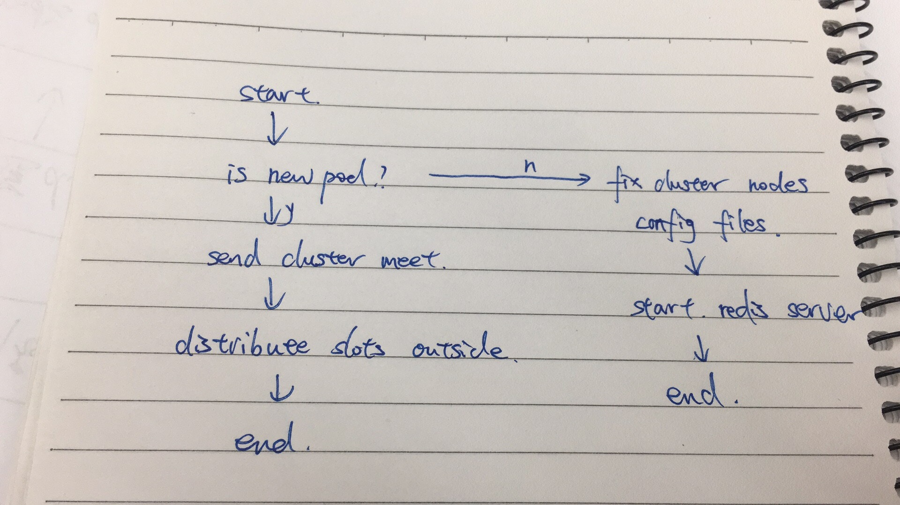

New Redis cluster solution
====
 
 **unstable 版本正在测试过程中,master分支为稳定版本.两个分支的逻辑是不同的.**   

  

**解决问题**
- redis集群新搭建时不用全部启动完成,由用户自己手动完成集群slot的分配
- redis集群扩容时更加自由
- redis集群恢复时不用全部节点都启动完成,自愈能力更强

**缺点**
- 用户需要了解redis集群slot 的概念
- 集群不是全自动化

鱼与熊掌不可兼得呀